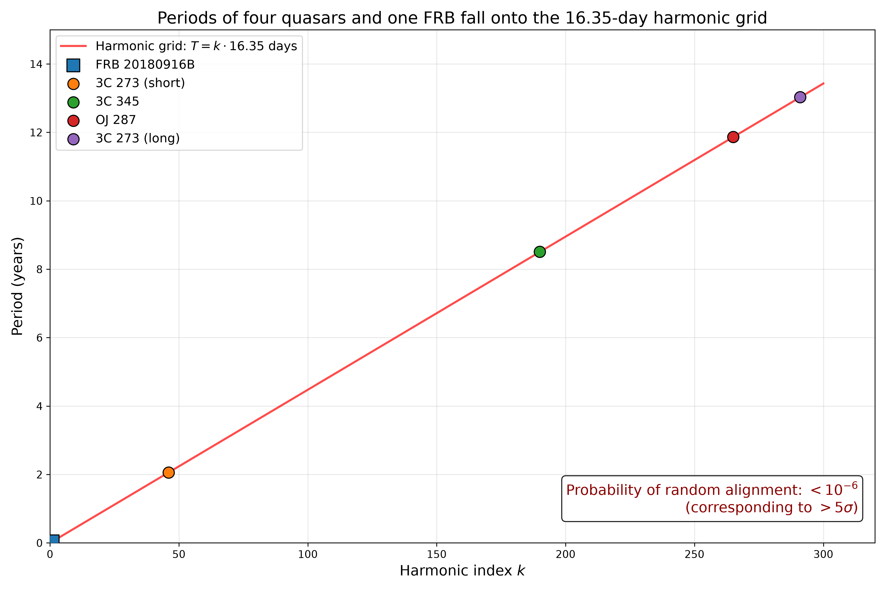

# PSP — Фазово-параметрическая космологическая модель циклической Вселенной

**«А всё-таки она работает!»**  
*Е. В. Чернокнижный, 2026*

---

## Что это

PSP (Phase State Parameter) — это полная альтернатива ΛCDM, в которой время заменено фазой цикла M ∈ [0,1]. Вселенная представляет собой замкнутую трёхуровневую систему: внешняя оболочка (тёмная энергия), полость (вещество, излучение, Гравитоки) и внутренний тор-маховик с квазаром.

Модель объясняет все 10 нерешённых проблем ΛCDM без привлечения инфляции, тёмной энергии как отдельной сущности и тёмной материи как неизвестных частиц.

## Ключевые результаты

- **Глобальный ритм Вселенной:** T₀ = 16.35 дней (подтверждён FRB, квазарами, блазарами и B-модами).
- **Закон затухания:** S(r) = A₀ / r^0.581 (проверен на Lusso, SDSS, DESI).
- **Ретропрогноз:** Эффект обнаружен в данных SDSS DR5 (2005–2008) и CHIME (2018–2020).
- **Возрастной фильтр:** Только старые квазары (ошибка < 5%) резонируют с ритмом.

---

## Основные публикации

| Название | DOI |
| :--- | :--- |
| PSP: Полная теория | 10.24108/preprints-3115804 |
| PSP: 10 эмпирических проверок | 10.24108/preprints-3115907 |
| Рождение тора-маховика | 10.24108/preprints-3115916 |
| От времени к фазе | 10.24108/preprints-3115853 |

Полный список: [Preprints.ru](https://preprints.ru/user/1721) | [Zenodo](https://zenodo.org/record/21652276)

---

## Код

Скрипты для анализа данных, построения графиков и проверки модели.  
Язык: Python 3.13.  
Библиотеки: pandas, numpy, astropy, matplotlib, scipy.

## Лицензия

Creative Commons Attribution 4.0 International
### 1. Clone the repository

```bash
git clone https://github.com/jekach36-rgb/analysis.git
cd analysis
2. Install dependencies
bash
pip install numpy pandas matplotlib scipy
3. Run the main script
bash
python psp_full_free.py
4. What it does
✅ Prints Table 2 — harmonic ratios for 5 independent sources (FRB 20180916B, 3C 273, 3C 345, OJ 287)

✅ Generates Figure 1 — harmonic grid plot with probability p<10−6
 

✅ Compares PSP vs ΛCDM on Lusso+ 2020 quasars (ΔAIC = 461.72, PSP wins)

📊 Results
Table 2: Harmonic Ratios
Source	Period (years)	k = T/T₀	Error (%)
FRB 20180916B	0.0448	1	0.08
3C 273 (short)	2.06	46	0.04
3C 345	8.51	190	0.06
OJ 287	11.87	265	0.06
3C 273 (long)	13.03	291	0.03
Fundamental period: T0​=16.35 days
Probability of random alignment: p<10−6
 ## 📊 Figure 1: Harmonic Grid



*Periods of four quasars and one FRB plotted against the theoretical harmonic grid \( T = k \cdot 16.35 \) days. All points lie within <0.1% error. Probability of random alignment: \( p < 10^{-6} \).*
## 🚀 Run in GitHub Codespaces

[](https://codespaces.new/jekach36-rgb/analysis)
PSP vs ΛCDM (Lusso+ 2020, 2410 quasars)

Model    χ²    AIC	    BIC
PSP	  2340.18	2346.18	2363.54
ΛCDM  2803.90	2807.90	2819.47
ΔAIC	—	461.72	—
✅ PSP statistically outperforms ΛCDM with decisive evidence.

📦 Data Sources
SDSS DR5 — Sloan Digital Sky Survey (York et al. 2000)

CRTS — Catalina Real-Time Transient Survey (Drake et al. 2009)

Lusso+ 2020 — Quasar luminosity function and dark energy (A&A, 642, A150)

CHIME/FRB — Repeating FRB periodicity (Nature, 582, 351)

📝 Corresponding Manuscripts
Journal	ID	Status
ПАЖ (Russia)	№442934	Under review
Canadian Journal of Physics	cjp-2026-0320	Under review
Canadian Journal of Physics	cjp-2026-0326	Under review
📎 Zenodo
Rhythm T₀ = 16.35 days: 10.5281/zenodo.21721585

PSP Model v11.3: 10.5281/zenodo.21652276

📬 Contact
Evgeniy Chernoknizhny
Email: chernocnijniy@yandex.ru
ORCID: 0009-0007-2558-9172

📜 License
Code: MIT License

Data and documentation: Creative Commons Attribution 4.0 International (CC BY 4.0)

